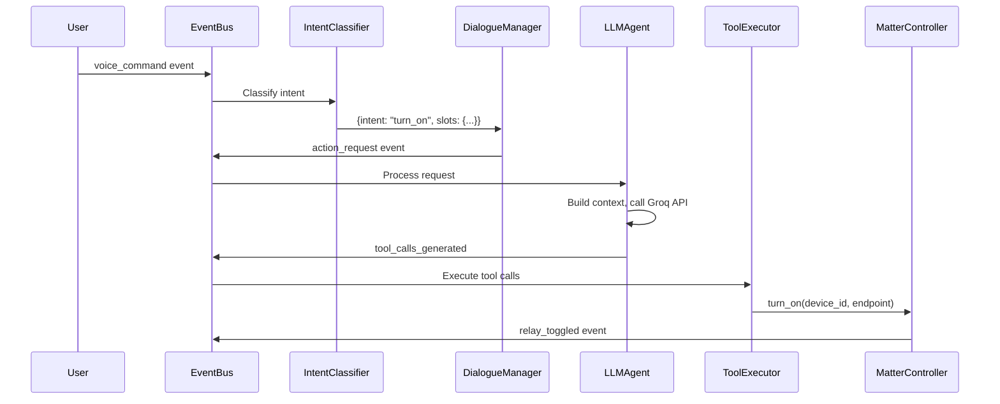

# 🏠 ARVIS (Jarvis) - Project Summary

> An AI-powered intelligent home automation agent system

## What This Project Is

**ARVIS** is an intelligent home automation agent designed to:
- Understand natural language voice commands
- Control smart home devices (lights, relays, appliances)
- Learn user patterns and preferences
- Execute complex multi-step "missions" (like "prepare date night")
- Proactively suggest actions based on context

---

## The LLM Integration

### Core AI Decision-Maker

The system uses **Groq's API** with the **`meta-llama/llama-4-scout-17b-16e-instruct`** model.

| Component | Location | Purpose |
|-----------|----------|---------|
| LLMAgent | `agent/llm_agent/llm_agent.py` | Main event handler that calls LLM for decisions |
| System Prompt | `agent/llm_agent/prompt.py` | Basic home agent instructions |
| Planning Prompt | `agent/llm_agent/prompt_planning.py` | Sensor-aware reasoning rules |
| Dialogue Manager | `agent_conversation/dialogue_manager.py` | Conversational LLM for chat |
| Plan Generator | `agent_plan/plan_generator.py` | Hybrid rule-based + LLM planning |

### How the LLM Works

1. **Subscribes to events**: `voice_command`, `time_tick`, `relay_toggled`
2. **Builds context**: Current event, state summary, routines, preferences, safety rules
3. **Calls Groq API** with tool schemas
4. **Outputs tool calls** (JSON function calls) that get executed

### System Prompt Rules

The LLM is instructed to:
- ❌ NEVER output plain text
- ✅ ALWAYS output JSON tool calls
- ✅ Follow safety guidelines strictly
- ✅ Avoid duplicate actions (idempotent planning)
- ✅ Ask for confirmation when unsure

### Sensor-Aware Reasoning

From `prompt_planning.py`:

| Rule | Example |
|------|---------|
| **Sleep-State Safeguards** | If sleeping and request is vague → ASK FIRST |
| **Location Awareness** | If user says "lights" but is in bedroom → infer bedroom |
| **Activity-Aware** | If `activity_hint = "cooking"` → prefer kitchen devices |
| **Presence Awareness** | If `home_presence = "away"` → avoid turning on devices |
| **Time Adaptation** | Morning = bright/cool, Evening = warm/dim, Night = minimal |

---

## Available LLM Tools

| Tool | Description |
|------|-------------|
| `turn_on` | Turn on a device endpoint |
| `turn_off` | Turn off a device endpoint |
| `create_routine` | Create automation with trigger + actions |
| `modify_routine` | Edit existing routine |
| `run_routine` | Execute a routine's actions |
| `ask_user` | Request clarification when uncertain |
| `log_note` | Store observations for learning |

---

## Tool Execution System

### Tool Executor (`agent/tools/executor.py`)

Receives `tool_calls_generated` events and executes them:

```
LLM generates tool call → Published as event → Tool Executor → Execute action
```

### Plan Executor (`agent_plan/plan_executor.py`)

Executes structured **Plan Graphs** (DAGs):
- Runs layers in parallel with threading
- Validates each layer through `SafetyValidator`
- Publishes `action_execution` events

### Mission Executor (`agent_mission/mission_executor.py`)

Handles long-running multi-step missions:
- ✅ Async execution with layer-by-layer advancement
- ✅ Persistence - survives system restarts
- ✅ Retry logic with exponential backoff
- ✅ Safety validation before each layer
- ✅ Pause, resume, and cancel support

---

## System Architecture

```
┌─────────────────────────────────────────────────────────────────────────┐
│                              EVENT BUS                                  │
│                    (Central pub/sub communication)                      │
└─────────────────┬────────────────────────────────────────────────────────┘
                  │
    ┌─────────────┼─────────────┬─────────────┬─────────────┐
    ▼             ▼             ▼             ▼             ▼
┌─────────┐ ┌──────────┐ ┌───────────┐ ┌──────────┐ ┌──────────────┐
│  Input  │ │Cognitive │ │  Dialogue │ │  Mission │ │    Sensors   │
│  Layer  │ │   Loop   │ │  Manager  │ │  System  │ │  & Estimator │
└────┬────┘ └────┬─────┘ └─────┬─────┘ └────┬─────┘ └──────┬───────┘
     │           │             │            │              │
     │           ▼             ▼            ▼              ▼
     │      ┌─────────────────────────────────────────────────┐
     │      │              LLM (Groq/Llama-4)                 │
     │      │  - Understands commands                        │
     │      │  - Generates tool calls                        │
     │      │  - Plans multi-step actions                    │
     │      └──────────────────┬──────────────────────────────┘
     │                         │
     │                         ▼
     │              ┌─────────────────────┐
     │              │    Tool Executor    │
     │              │   / Plan Executor   │
     │              └──────────┬──────────┘
     │                         │
     └────────────────────────►│
                               ▼
                    ┌─────────────────────┐
                    │  MatterController   │
                    │  (Virtual/Physical) │
                    └─────────────────────┘
```

---

## Key Components

| Component | Location | Purpose |
|-----------|----------|---------|
| EventBus | `agent/event_bus/event_bus.py` | Central pub/sub communication |
| StateEngine | `agent/state_engine/state_engine.py` | Device state tracking |
| CognitiveLoop | `agent_cognitive/cognitive_loop.py` | Background reasoning cycle |
| MetaAgent | `agent/agent_cognitive/meta_agent.py` | Proactive decision making |
| StateEstimator | `agent_sensors/state_estimator.py` | Sensor fusion for home state |
| IntentClassifier | `agent_conversation/intent_classifier.py` | Regex-based fast intent matching |
| PersonalityManager | `agent_personality/personality_manager.py` | Response style customization |
| SafetyValidator | `agent_plan/safety_validator.py` | Pre-execution safety checks |
| MissionManager | `agent_mission/mission_manager.py` | Long-running workflow management |
| SceneRegistry | `agent_plan/scene_registry.py` | Pre-defined scene configurations |

---

## Features Implemented

| Feature | Status | Description |
|---------|--------|-------------|
| Event-Driven Architecture | ✅ | Everything via EventBus pub/sub |
| Virtual Device Mode | ✅ | Run without real hardware |
| Intent Classification | ✅ | Fast regex-based command parsing |
| Sensor Fusion | ✅ | Combines multiple sensors for home state |
| Personality System | ✅ | Customizable response styles |
| Proactive Engine | ✅ | MetaAgent cognitive loop |
| Safety Validation | ✅ | Pre-execution plan checks |
| Mission System | ✅ | Multi-step workflows with persistence |
| Scene Engine | ✅ | Pre-defined scene triggers |
| Learning Engine | 🔸 | Foundation present, basic implementation |

---

## Example Flow

**User says**: "Turn on the lights in the living room"



---

## Configuration

| File | Purpose |
|------|---------|
| `.env` | API keys (GROQ_API_KEY) |
| `config/settings.py` | Main configuration loader |
| `config/scenes/` | Scene definitions |
| `config/personality/` | Personality profiles |

---

## Running the System

```bash
# Install dependencies
pip install -r requirements.txt

# Set environment variable
export GROQ_API_KEY="your-api-key"

# Run the agent
python -m agent.main
```

The system starts:
- ✅ EventBus
- ✅ MatterController (virtual mode by default)
- ✅ StateEngine & Sensors
- ✅ Automation Engine
- ✅ Learning & Simulation
- ✅ Personality Engine
- ✅ Plan Executor
- ✅ Mission Control
- ✅ Dialogue System
- ✅ MetaAgent (cognitive loop)
- ✅ Web Dashboard at `http://localhost:5000`

---

## Project Structure

```
Automation/
├── agent/                    # Core agent modules
│   ├── llm_agent/           # LLM integration
│   ├── tools/               # Tool executor
│   ├── event_bus/           # Pub/sub system
│   ├── state_engine/        # State management
│   ├── controllers/         # Device controllers
│   ├── automations/         # Automation engine
│   └── web/                 # Web dashboard
├── agent_cognitive/         # Cognitive processing
├── agent_conversation/      # Dialogue & NLU
├── agent_mission/           # Mission system
├── agent_personality/       # Personality engine
├── agent_plan/              # Planning system
├── agent_sensors/           # Sensor fusion
├── config/                  # Configuration files
└── tests/                   # Test suite
```

---

*This is a modular, extensible home automation agent using LLMs for intelligent decision-making while maintaining safety constraints.*
