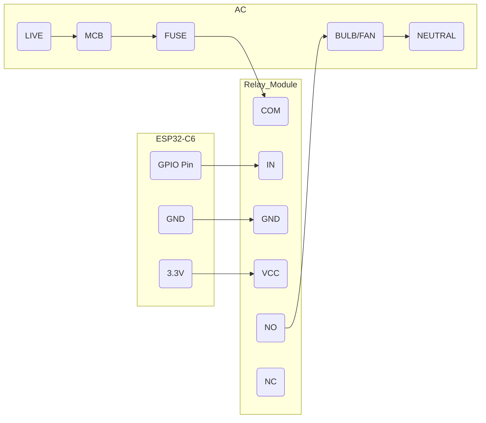
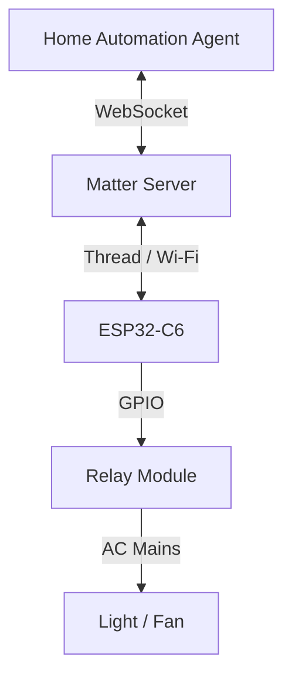
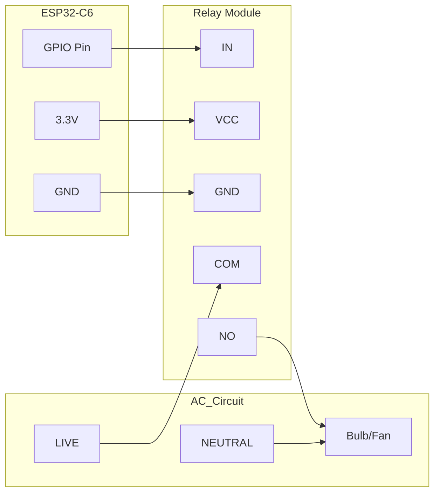
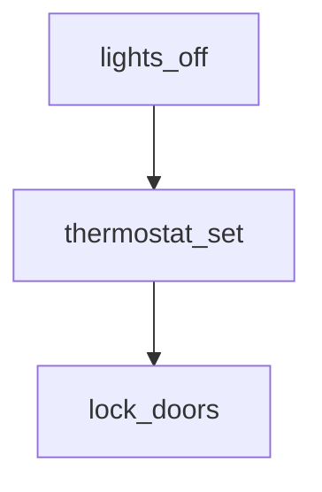
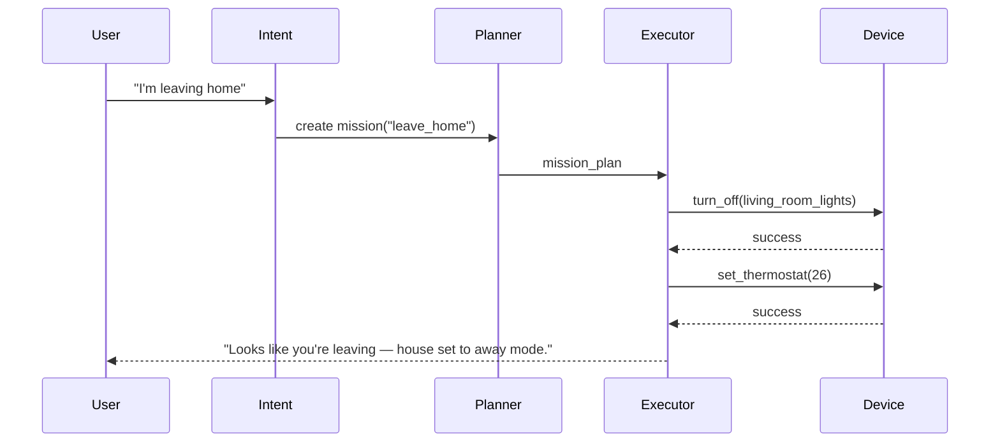

# Home Automation Agent – User Manual (Code-First Edition)

**Version: v0.9.1** — *Code-first; diagrams included*
Scope: local autonomy, mission engine, and DIY device integration using **ESP32-C6 + relays**.
UI: **no web UI** — everything via config, CLI, and logs.

---

## Table of contents

1. Introduction + Quickstart
2. Safety & Legal (must read)
3. Prereqs & Install (env, deps)
4. Quickstart (5–10 minute path)
5. Tested hardware & GPIO guidance
6. Hardware connection guide (diagrams)
7. Firmware strategy: ESP-Matter (recommended) & ESPHome (quick)
8. Matter integration (python-matter-server)
9. Running the Agent (commands + logs)
10. CLI tools & First-Run Device Test Suite (how to verify hardware)
11. Missions, Intent → Mission flow (diagrams)
12. Troubleshooting checklist (common failures + fixes)
13. Resetting & Recovery
14. Advanced config: Context graph & automations
15. Known limitations (v0.9.1)
16. Glossary + support

---

# 1. Introduction

Arvis is a **local, autonomous home cognition engine** — not a remote control system. It listens to events, learns patterns, suggests or executes automations, and runs missions (e.g., *going to sleep*, *leaving home*, *movie mode*). This release (v0.9.1) is developer-focused: code, config, and CLI only.

---

# 2. Safety & Legal (read before hardware)

**READ THIS FIRST.**

* **High voltage risk:** Smart relays switch 110V/220V AC. Mistakes can cause fire, serious injury, or death. If you’re unsure, hire a licensed electrician.
* **Fail-safe:** The Agent is software and can crash. Do **not** use it for life-safety systems (smoke alarms, medical devices, emergency exits). Provide physical manual overrides.
* **Network security:** Run on a private LAN. Do not expose control ports to the public internet. If remote access required, use VPN/WireGuard/secure reverse proxy.
* **Liability:** You are responsible for safe wiring and installation. This document provides guidance, not a substitute for electrical training.

---

# 3. Prerequisites & install

## 3.1 Hardware

* Always-on machine: Raspberry Pi 4/5, Intel NUC, or always-on PC.
* ESP32-C6 dev board(s) (see Tested list below).
* Relay modules (3.3V logic-compatible or use a level shifter).
* Power supplies for ESP (5V USB or DC-DC).
* Optional microphone & speaker for voice.

## 3.2 Software

* OS: Ubuntu 22.04+ recommended (Linux preferred), Windows 10/11 or macOS supported.
* Python **3.10+**.
* `git`, `pip`.

## 3.3 Clone & env

```bash
git clone https://github.com/your-repo/automation-agent.git
cd automation-agent
python -m venv venv
# Linux / macOS
source venv/bin/activate
# Windows
.\venv\Scripts\activate
pip install -r requirements.txt
```

---

# 4. Quickstart — zero thinking (5–10 minutes)

Follow this to see a light blink in minutes.

1. Flash the example ESPHome device: `examples/single_relay_device/esphome_relay.yaml` to your ESP32-C6.
2. Wire GPIO5 → Relay → Light (relay NO).
3. Add the device entry to `config/settings.yaml`.
4. Start python-matter-server (if using Matter) — optional for ESPHome.
5. Run agent: `python agent/main.py`
6. Test: `python agent/control.py turn_on kitchen_light`

If the light responds, you’re in business.

---

---

# **A. Installation Flow Diagram (new)**

Use this to check you’ve followed installation steps in order. Paste this mermaid diagram in your README to help contributors.

```mermaid
flowchart TD
  A[Clone repo & venv] --> B[Install requirements]
  B --> C[Choose firmware path]
  C -->|ESPHome| D[Flash ESPHome example]
  C -->|ESP-Matter| E[Build + flash ESP-Matter]
  D --> F[Wire relay to ESP]
  E --> F
  F --> G[Start matter-server (if using Matter)]
  G --> H[Add device to config/settings.yaml]
  H --> I[Run python agent/main.py]
  I --> J[Test with python agent/control.py]
```

---

# 5. Tested hardware & recommended GPIOs (CRITICAL)

## 5.1 Tested & Recommended boards (v0.9.1)

| Board                     |               Status | Notes                                                          |
| ------------------------- | -------------------: | -------------------------------------------------------------- |
| **ESP32-C6-DevKitC-1**    |        ✅ Recommended | Reference board; pinout matches examples                       |
| ESP32-C6 SuperMini        | ⚠️ Works (3.3V only) | Verify pinout; prefer 3.3V relays                              |
| ESP32-C6-WROOM (module)   |          ⚠️ Advanced | Needs breakout and correct wiring                              |
| Cheap “C6 NodeMCU” clones |             ❌ Varies | Many clones use different strapping pins — avoid for beginners |

## 5.2 Safe GPIO recommendations

**Safe pins for relays (v0.9.1):**

```
GPIO5, GPIO6, GPIO7, GPIO18
```

**Avoid (may brick or conflict):**

```
GPIO2 (strapping), GPIO8 (flash), GPIO9/10 (flash/boot), pins marked as strapping or JTAG in board docs
```

> **Why:** ESP32-C6 has strapping/boot pins and flash/SPI pins — using these can prevent boot or damage.

## 5.3 Relay logic & voltage

* **ESP32 GPIO = 3.3V.** Use **3.3V-compatible relay inputs** or a level-shifter/transistor driver. Do NOT drive 5V into an ESP pin.

---
---

# **B. Electrical connection diagram + wiring best practices (new)**

## B.1 — Safe wiring schematic (conceptual, not for live wiring copy)



> **Notes**
>
> * Put a proper fuse and, if inside a wall box, ensure insulating barriers and a certified enclosure.
> * Always switch the **live** conductor with the relay (not neutral).
> * Use **NO** for typical ON/OFF behavior. NC used only when default-on safety is required.
> * Use SSR / zero-cross triac for dimming or inductive loads. Mechanical relays OK for simple on/off loads.

## B.2 — Wiring best practices (practical)

1. **Isolation & enclosures**

   * Mount relays and ESP boards inside proper enclosures.
   * Keep mains wiring isolated from low-voltage wiring.
   * Use terminal blocks or PCB screw terminals — avoid breadboards for mains.

2. **Fuse & protection**

   * Put a fuse on the mains live feeding the relay. Choose fuse rating appropriate to load (e.g., 2–5A for single lamp circuits).
   * If you plan to switch motors/fans, use inrush-capable fuses.

3. **Grounding**

   * Ensure mains earth is correctly connected where needed. ESP GND must be common with relay module ground if using transistor drivers/optocouplers. Do NOT connect earth to GPIO.

4. **Relay coil driving**

   * If relay module expects 5V VCC, use a transistor driver or opto-isolator and provide correct VCC. Do not drive 5V into ESP32 GPIO.

5. **Suppress EMI & transients**

   * For inductive loads (motors), place an RC snubber across contacts or use a MOV (with care). SSRs and snubbers reduce arcing and EMI.
   * Adding small RC across relay coil (if driving coil directly) can reduce bounce if required (but also check relay module docs).

6. **Cable sizing**

   * Use wire rated for mains voltage and current. Solid-core for permanent wiring; stranded for terminals.

7. **Label everything**

   * Label GPIO pin mapping, relay channel number, and load circuit for future maintenance.

8. **Test without mains first**

   * Validate toggling logic using an LED or low-voltage dummy load before connecting mains.

---

# 6. Hardware connection guide (diagrams + concept)

## 6.1 High-level architecture



## 6.2 Conceptual wiring (high-level)



> **Safety:** This is conceptual only. Verify datasheets. Turn off mains before wiring.

## 6.3 Debounce & EMI

* Mechanical relays bounce; implement **100–300 ms debounce** in firmware/agent to avoid double toggles.
* SSRs are quieter and produce less EMI.

---

# 7. Firmware strategy (ESP32-C6)

Two recommended paths:

## 7.1 Option A — **ESP-Matter** (recommended)

* Pros: true Matter device, interoperable, works with python-matter-server, best long-term.
* Cons: heavier toolchain (ESP-IDF + build), slightly longer setup.

**Build & flash:**

```bash
# install esp-idf, then in example:
idf.py set-target esp32c6
idf.py build
idf.py -p /dev/ttyUSB0 flash
idf.py -p /dev/ttyUSB0 monitor
```

From serial logs you’ll get a **setup payload** (manual code / QR) for commissioning.

## 7.2 Option B — **ESPHome** (fast path)

* Pros: very quick to get a relay working; friendly YAML.
* Cons: Not Matter-native; control via HTTP/mDNS/api.

Example `esphome_relay.yaml` (in `examples/single_relay_device/`):

```yaml
esphome:
  name: kitchen_light
  platform: esp32
  board: esp32-c6-devkitc-1

wifi:
  ssid: "YOUR_SSID"
  password: "YOUR_PASSWORD"

logger:
api:
ota:

switch:
  - platform: gpio
    pin: 5
    name: "Kitchen Light Relay"
    id: relay_1
    restore_mode: ALWAYS_OFF
```

Flash with:

```bash
esphome run examples/single_relay_device/esphome_relay.yaml
```

---

# **F. ESPHome vs ESP-Matter — Comparison Table (new)**

| Feature                             |                      ESPHome (HTTP/mDNS) | ESP-Matter (ESP-Matter + python-matter-server)                  |
| ----------------------------------- | ---------------------------------------: | --------------------------------------------------------------- |
| Learning curve                      |                                      Low | Medium → Higher                                                 |
| Time to first working device        |                                  Minutes | Hours                                                           |
| Interoperability (other ecosystems) |                    Local to HA (or HTTP) | High — Matter standard (Interoperable)                          |
| OTA updates                         |                     Built-in via ESPHome | Possible via ESP-IDF tooling; more setup                        |
| Thread / Thread+Matter              |                         No native Thread | Native Thread/Matter (on supporting hardware)                   |
| Long-term robustness                |                                     Good | Best for standard compliance                                    |
| Recommended when                    | Rapid prototyping, single device control | Building a Matter-compliant product or multi-vendor deployments |

**Recommendation:** Start with **ESPHome** to validate hardware quickly; migrate to **ESP-Matter** for production and cross-vendor compatibility.

---


# 8. Matter integration (python-matter-server)

## 8.1 Install & run

```bash
python -m venv matter-venv
source matter-venv/bin/activate
pip install python-matter-server
matter-server --storage-path ./matter-storage
```

Default WebSocket: `ws://localhost:5580`

## 8.2 Commission device

Get QR/manual code from ESP serial after flashing ESP-Matter and run:

```bash
matter-host-cli commission-onnetwork 34970112332
# or:
matter-host-cli commission-with-code "<QR_STRING>"
```

List nodes:

```bash
matter-host-cli list-nodes
```

Add `node_id` to `config/settings.yaml` for the agent to reference.

---

# **D. Detailed Matter commissioning troubleshooting (new)**

If commissioning fails or devices don't appear in `matter-host-cli list-nodes`, follow these steps:

### Check 1 — Serial output on ESP

* Re-open serial monitor: `idf.py -p /dev/ttyUSB0 monitor` (ESP-Matter) or check `esphome logs device.yaml` (ESPHome).
* Look for `Setup Payload` or errors during Wi-Fi connection.

  * If no Wi-Fi, re-check SSID/password in firmware.

### Check 2 — Matter Server logs

* Start matter server in terminal to see logs and errors.
* If using `matter-server`, check that storage path exists and is writable.
* If the server fails to bind WebSocket, ensure no other process uses the port `5580` (or change via args).

### Check 3 — Commission with manual code

* If QR scan fails, use manual code printed on serial:

  ```bash
  matter-host-cli commission-with-code "MT:...yourpayload..."
  ```
* If `commission-with-code` fails with `invalid payload`, re-copy the exact string from serial monitor.

### Check 4 — Node unreachable after commissioning

* Confirm the node is `Reachable: True`:

  ```bash
  matter-host-cli list-nodes
  ```
* If `Reachable: False`:

  * Verify Wi-Fi network (2.4GHz vs 5GHz mismatch).
  * Check AP isolation or client isolation on router — disable it.
  * Ensure device and matter-server are on same subnet or proper routing exists.

### Check 5 — Persistent pairing issues

* Clear the matter server storage and re-start:

  ```bash
  rm -rf ./matter-storage/*
  matter-server --storage-path ./matter-storage
  ```
* Reboot ESP device and re-commission.

### Check 6 — Certificate or crypto errors

* If commissioning prints crypto/attestation errors, ensure ESP-IDF + ESP-Matter versions used match docs—mismatched SDK versions can cause crypto errors.

### Common error messages & fixes

* `Timeout waiting for device` → Check device Wi-Fi connectivity, reduce firewall blocks.
* `Invalid payload` → copy/paste error; re-run `idf.py monitor` and re-copy manual code.
* `NodeId already exists` → remove node from server storage and re-commission.
* `WebSocket connection refused` → matter-server not running or wrong `server_ws_url` in agent settings.

---

# 9. Running the Agent

Activate venv and run:

```bash
cd automation-agent
source venv/bin/activate    # Windows: .\venv\Scripts\activate
python agent/main.py
```

Expected logs:

```text
[CORE] Event bus initialized.
[STATE] State engine loaded.
[COG] Cognitive loop started.
[INTERACTION] Voice/Text interaction loop started.
[MATTER] Connected to Matter server ws://localhost:5580
```

---

# **E. Example logs for key flows (new)**

Use these to compare with your runtime logs when troubleshooting.

## E.1 Agent startup (successful)

```
2025-11-29 19:36:35 [INFO][CORE] Event bus initialized.
2025-11-29 19:36:35 [INFO][STATE] State engine loaded. history_size=12000
2025-11-29 19:36:35 [INFO][COG] Cognitive loop started. cadence=60s
2025-11-29 19:36:36 [INFO][INTERACTION] Voice/Text interaction loop started.
2025-11-29 19:36:36 [INFO][MATTER] Connecting to Matter server ws://localhost:5580
2025-11-29 19:36:36 [INFO][MATTER] Connected. known_nodes=1
2025-11-29 19:36:36 [INFO][PROACTIVE] Proactive engine loaded. patterns=3
```

## E.2 device test output (expected)

```
[TEST_DEVICE] kitchen_light: reachability -> ping 192.168.1.45: OK
[TEST_DEVICE] Attempt TURN ON -> command -> ACK
[TEST_DEVICE] State read -> "on"
[TEST_DEVICE] Auto-off verify -> TURN OFF -> "off"
[TEST_DEVICE] Bounce test -> 50 toggles -> max_latency=30ms -> OK
✨ Test Complete. Device seems operational.
```

## E.3 Matter commissioning trace

```
[ESP32] [APP] Setup Payload:
  Manual Code: 34970112332
  QR Code: MT:ABCDEF...
[MATTER_HOST] Received commissioning request for code 34970112332
[MATTER_HOST] Commissioning success: NodeId=12345, DeviceType=OnOffLight, Reachable=True
```

## E.4 mission execution (leave_home)

```
[MISSION] start leave_home by user_john (id=mf3a)
[MISSION] step 1: turn_off living_room_lights -> send_command(node=12345, cluster=OnOff, cmd=Off)
[DEVICE] node=12345 ack -> success
[MISSION] step 2: set_thermostat -> send_command(node=67890, cluster=Thermostat, setpoint=26)
[DEVICE] node=67890 ack -> success
[MISSION] step 3: lock_front_door -> requires_user_confirmation -> user confirmed
[DEVICE] node=55555 ack -> success
[MISSION] complete leave_home (duration=5.2s)
[NOTIFY] "Looks like you're leaving — house set to away mode."
```

## E.5 unreachable device error

```
[DEVICE] node=99999 -> send_command failed: TimeoutError
[RETRY] retrying in 2s (attempt=1/3)
[RETRY] attempt 2 failed
[FAIL] device node=99999 unreachable after 3 attempts -> raising AutomationException
[ALERT] "Could not set thermostat: device unreachable. Please check device power and network."
```

---


# 10. CLI tools & First-Run Device Test Suite (recommended)

## 10.1 Control CLI (built-in)

Examples:

```bash
python agent/control.py turn_on kitchen_light
python agent/control.py turn_off kitchen_light
python agent/control.py status kitchen_light
```

`control.py` auto-detects `controller: matter` or `esphome_http` from `settings.yaml`.

## 10.2 First-Run Device Test Suite

Before enabling any mission automation, run the test suite to validate wiring/firmware.

**Command**

```bash
python agent/devices/test_device.py kitchen_light
```

**What it runs**

1. Reachability (ping / Matter reachability)
2. Turn ON -> confirm state
3. Wait 500ms -> Turn OFF -> confirm state
4. Bounce/debounce verification
5. Status readback

**Expected output**

```text
1. Checking Reachability... ✅ OK
2. Testing TURN ON... ✅ OK
3. Testing TURN OFF... ✅ OK
✨ Test Complete. Device seems operational.
```

If any test fails, follow hardware troubleshooting (section 12).

## 10.3 Example `agent/control.py` (simplified)

```python
# simplified example to include in repo
import sys, requests
from agents import matter_controller, wifi_controller, settings

def main():
    cmd = sys.argv[1]
    device_id = sys.argv[2]
    device = settings.get_device(device_id)
    if device['controller'] == 'matter':
        if cmd == 'turn_on': matter_controller.turn_on(device['node_id'])
        if cmd == 'turn_off': matter_controller.turn_off(device['node_id'])
    else:
        if cmd == 'turn_on': requests.post(f"{device['endpoint']}/switch/relay_1/turn_on")
        if cmd == 'turn_off': requests.post(f"{device['endpoint']}/switch/relay_1/turn_off")

if __name__ == '__main__':
    main()
```

(Place a more robust version in `agent/control.py`.)

---
# **C. Mission DAG example (expanded)**

This is a concrete mission DAG you can add to `examples/missions/leave_home.yaml` to test complex sequencing.

```yaml
mission_id: leave_home
steps:
  - id: lights_off
    type: device_action
    device: living_room_lights
    action: turn_off
    precondition:
      - device_state: living_room_lights == "on"
    retry: 3
    timeout_seconds: 5
  - id: thermostat_set
    type: device_action
    device: thermostat_1
    action: set_temperature
    params:
      value: 26
    depends_on: [lights_off]
    retry: 2
    timeout_seconds: 8
  - id: lock_doors
    type: device_action
    device: front_door_lock
    action: lock
    depends_on: [thermostat_set]
    requires_user_confirmation: true
```

Visualized:



Explanation:

* `lights_off` runs first; if already off, it's skipped.
* `thermostat_set` runs after `lights_off`.
* `lock_doors` is critical; agent will ask the user to confirm before executing.

---


# 11. Missions & Intent → Mission flow (diagrams + explanation)

## 11.1 High-level flow (ASCII + mermaid)

```text
User Input ("I'm leaving home")
      │
      ▼
[Intent Parser] ───> (intent="mission", name="leave_home")
      │
      ▼
[Mission Planner] <── [State Engine] (Current: Lights=ON, Door=UNLOCKED)
      │
      │ (Generates Dependency Graph)
      ▼
   [Plan DAG]
      │ Step 1: Turn Off Lights (Parallel)
      │ Step 2: Set Thermostat (Sequential, wait for 1)
      │ Step 3: Lock Doors (Critical, wait for 2)
      ▼
[Mission Executor]
      │
      ├──> [Step 1: Turn Off Lights]
      │       │
      │       ├── (Pre-Check) ──> Is Light already OFF? (Skip if yes)
      │       │
      │       ├── (Action) ─────> [Device Controller] ──> [Hardware]
      │       │                                              │
      │       └── (Verify) <───── [State Engine] <───────────┘
      │               │
      │           (Success)
      │               ▼
      ├──> [Step 2: Set Thermostat] ...
      │
      └──> [Step 3: Lock Doors] ...
              │
          (Mission Complete)
              │
              ▼
      [User Notification] ("House is secure.")
```



## 11.2 Safety & retries

* Each step has: **precondition, confidence threshold, safety gating**.
* Steps retry with exponential backoff; critical steps require explicit user opt-in.

---

# 12. Troubleshooting (fast checklist)

## 12.1 Hardware

* **Relay never clicks**

  * ESP powered? (3.3V/5V)
  * Correct GPIO in firmware?
  * Relay logic (active LOW vs HIGH)?
  * Relay VCC must match relay module spec.

* **Light always ON**

  * Wired to **NC** instead of **NO**.
  * Live/neutral swapped.

* **ESP not booting**

  * Used forbidden pin (strapping). Re-flash after moving pin.

## 12.2 Network / Firmware

* **Device unreachable**

  * For ESPHome: `esphome logs device.yaml`
  * For Matter: `matter-host-cli list-nodes` and check `Reachable: True`

* **mDNS/hostname fails**

  * Local DNS/resolution issues; try IP address.

## 12.3 Agent

* **Agent says “I can’t control that device.”**

  * Check `config/settings.yaml` for device entry and controller type.
  * Check `logs/agent.log` for stacktrace.

* **Agent appears to hallucinate**

  * Run `stop everything` command if mapped.
  * Restart agent. If repeated, disable cloud LLM calls in `settings.yaml`.

---

# **G. Emergency / “If something burns” checklist (new)**

If you detect smoke, smell burning, or observe sparks — act immediately:

1. **Kill power first** — Flip the main breaker for the affected circuit or whole house. That isolates mains quickly.
2. **Disconnect agent machine (if safe)** — unplug Raspberry Pi / NUC from power if safe to do so after breaker off.
3. **Do not touch** hardware until mains power is off and cooled.
4. **Use fire extinguisher (Class C / appropriate)** if an electrical fire is small and you are trained. Otherwise evacuate and call emergency services.
5. **Document** what happened (photos) and mark the device IDs involved in the repo issue for later forensic.
6. **Replace damaged hardware**; do not re-use a charred relay board or cable. Restart only after inspection.
7. **Review wiring best practices** and add fuses/RC snubbers or move to SSRs for inductive loads.

---


# 13. Resetting & Recovery

## 13.1 Wipe agent memory (fresh brain)

```bash
# Stop agent
rm -rf data/
python agent/main.py
```

## 13.2 Reset ESP32-C6

* Hold BOOT/EN to enter flash mode and re-flash firmware. Refer to your board docs.

## 13.3 Remove Matter device

```bash
matter-host-cli remove-node 12345
# Remove from settings.yaml
```

---

# 14. Advanced configuration

## 14.1 Rooms, Zones & Context Graph

`data/cognitive/context_graph.json` defines rooms & adjacency.

Example:

```json
{
  "nodes": [
    {"id":"room_kitchen","type":"room","name":"Kitchen"},
    {"id":"room_living","type":"room","name":"Living Room"}
  ],
  "edges":[
    {"from":"room_kitchen","to":"room_living","type":"adjacent"}
  ]
}
```

## 14.2 Manual automations (`config/automations.yaml`)

```yaml
- id: "hallway_nightlight"
  trigger:
    type: "motion"
    device: "hallway_motion"
  condition:
    type: "time_range"
    after: "22:00"
    before: "06:00"
  action:
    - type: "turn_on"
      device: "hallway_light"
      brightness: 20
    - type: "auto_off_after"
      device: "hallway_light"
      seconds: 120
```

---

# 15. Known limitations (v0.9.1)

Be explicit — transparency reduces angry users.

* **No dimmer/triac** support (ON/OFF only).
* **No OTA firmware via agent** (manual ESPHome/IDF flash required).
* **No IR/AC remote emulation** (planned).
* **Multi-user presence** logic is experimental.
* **Pattern inventory limited** to: Night Wind-Down, Leaving-Home, AC override (others in roadmap).
* **Mobile app / UI**: none; config/CLI only.
* **One mission at a time** default; concurrent missions may be limited.

---

# 16. Glossary & support

**Agent** — Python process running Arvis.
**Mission** — High-level goal broken into steps.
**Cognitive Loop** — Periodic analysis for pattern detection.
**Matter** — Local interoperable smart home protocol.
**ESPHome** — YAML-driven ESP firmware.
**ESP32-C6** — Espressif MCU (Wi-Fi 6 + 802.15.4).
**NO/NC** — Relay contacts: Normally Open / Normally Closed.

If you hit edge cases, open an issue with:

* OS + version
* Python version
* `settings.yaml` (sanitized, no API keys)
* `logs/agent.log` excerpts
* Steps to reproduce

---

## Appendix — files & example locations (repo layout)

```
automation-agent/
├─ agent/
│  ├─ main.py
│  ├─ control.py
│  └─ devices/test_device.py
├─ config/
│  ├─ settings.example.yaml
│  └─ settings.yaml
├─ examples/
│  └─ single_relay_device/
│     └─ esphome_relay.yaml
├─ docs/
│  └─ user_manual_v0.9.1.md
└─ data/
```
