# ARVIS Forensic Deep-Dive Audit Report

## Executive Summary

**Project Name:** ARVIS (Autonomous Residential/Commercial Virtual Intelligence System)  
**Version:** 1.0.0 Production  
**Audit Date:** 2026-02-22  
**Audit Type:** Implementation Code Analysis (Documentation/Test Artifacts Excluded)

ARVIS is a sophisticated **dual-mode neural operating system** designed for intelligent building management. The system operates in two distinct vertical modes:

| Mode | Domain | Primary Focus |
|------|--------|---------------|
| **RESIDENTIAL** | Smart Home | Comfort, convenience, energy optimization, voice interaction |
| **COMMERCIAL** | Building Management Systems (BMS) | Equipment health, alarms, energy efficiency, predictive maintenance |

---

## 1. Problem Domain & Value Proposition

### 1.1 Core Problem Statement

The codebase addresses a fundamental gap in building automation: **the lack of intelligent, context-aware orchestration across heterogeneous building systems**. Traditional Building Management Systems (BMS) and smart home platforms suffer from:

1. **Protocol Fragmentation**: BACnet, Modbus, Matter, Zigbee, WiFi devices operate in silos
2. **Reactive vs. Proactive**: Systems respond to events but cannot predict or prevent issues
3. **Static Automation**: Rules-based triggers lack adaptability to user preferences
4. **Operator Cognitive Load**: Commercial BMS operators face alarm fatigue and information overload

### 1.2 Value Proposition

ARVIS delivers value through:

| Capability | Residential Value | Commercial Value |
|------------|-------------------|------------------|
| **Natural Language Interface** | Voice-controlled home automation | Conversational BMS operations copilot |
| **Predictive Intelligence** | Anticipatory comfort adjustments | Predictive maintenance, energy forecasting |
| **Adaptive Learning** | Learns user preferences automatically | Learns operator patterns, calibrates trust |
| **Multi-Option Advisory** | Proactive suggestions | What-if scenario simulation, decision support |
| **Protocol Unification** | Matter, WiFi, virtual devices | BACnet, Modbus, REST APIs |

---

## 2. Architectural Framework

### 2.1 High-Level Architecture

```
┌─────────────────────────────────────────────────────────────────────────────┐
│                           ARVIS NEURAL OPERATING SYSTEM                      │
├─────────────────────────────────────────────────────────────────────────────┤
│  ┌─────────────────────────────────────────────────────────────────────┐    │
│  │                        API LAYER (FastAPI)                           │    │
│  │  ┌──────────┐ ┌──────────┐ ┌──────────┐ ┌──────────┐ ┌──────────┐  │    │
│  │  │  Agent   │ │   BMS    │ │ Advisory │ │  Voice   │ │  Mission │  │    │
│  │  │ Router   │ │  Routers │ │  Router  │ │  Router  │ │  Router  │  │    │
│  │  └──────────┘ └──────────┘ └──────────┘ └──────────┘ └──────────┘  │    │
│  └─────────────────────────────────────────────────────────────────────┘    │
│                                    │                                         │
│  ┌─────────────────────────────────▼───────────────────────────────────┐    │
│  │                     CORE INFRASTRUCTURE                               │    │
│  │  ┌──────────────┐  ┌──────────────────┐  ┌───────────────────────┐  │    │
│  │  │  EventBus    │  │ MemoryOrchestrator│  │ UnifiedLLM Client    │  │    │
│  │  │  (Pub/Sub)   │  │  (Preferences,    │  │  (K2-Think, Groq,    │  │    │
│  │  │              │  │   Observations)   │  │   NVIDIA, Gemini)    │  │    │
│  │  └──────────────┘  └──────────────────┘  └───────────────────────┘  │    │
│  └─────────────────────────────────────────────────────────────────────┘    │
│                                    │                                         │
│  ┌─────────────────────────────────▼───────────────────────────────────┐    │
│  │                     AGENT LAYER (Specialized Modules)                │    │
│  │                                                                      │    │
│  │  ┌─────────────────────┐        ┌─────────────────────────────────┐ │    │
│  │  │   RESIDENTIAL MODE  │        │      COMMERCIAL MODE            │ │    │
│  │  │  ┌───────────────┐  │        │  ┌───────────────────────────┐  │ │    │
│  │  │  │ StateEngine   │  │        │  │ BMSStateEngine            │  │ │    │
│  │  │  │ MatterCtrl    │  │        │  │ AlarmEngine               │  │ │    │
│  │  │  │ AutomationEng │  │        │  │ EnergyAnalyzer            │  │ │    │
│  │  │  │ LearningEng   │  │        │  │ PredictiveMaintenance     │  │ │    │
│  │  │  │ VoicePipeline │  │        │  │ FleetIntelligence         │  │ │    │
│  │  │  └───────────────┘  │        │  └───────────────────────────┘  │ │    │
│  │  └─────────────────────┘        └─────────────────────────────────┘ │    │
│  │                                                                      │    │
│  │  ┌──────────────────────────────────────────────────────────────┐   │    │
│  │  │              SHARED COGNITIVE LAYER                           │   │    │
│  │  │  ┌────────────┐ ┌─────────────┐ ┌────────────┐ ┌───────────┐ │   │    │
│  │  │  │ Cognitive  │ │  Advisory   │ │  Mission   │ │  Planning │ │   │    │
│  │  │  │   Loop     │ │   System    │ │  Executor  │ │   Flow    │ │   │    │
│  │  │  └────────────┘ └─────────────┘ └────────────┘ └───────────┘ │   │    │
│  │  └──────────────────────────────────────────────────────────────┘   │    │
│  └─────────────────────────────────────────────────────────────────────┘    │
│                                    │                                         │
│  ┌─────────────────────────────────▼───────────────────────────────────┐    │
│  │                     PROTOCOL ADAPTERS                                │    │
│  │  ┌──────────┐ ┌──────────┐ ┌──────────┐ ┌──────────┐ ┌──────────┐  │    │
│  │  │ BACnet   │ │  Matter  │ │  WiFi    │ │ REST API │ │ Virtual  │  │    │
│  │  │ Adapter  │ │  Server  │ │  Client  │ │  Client  │ │ Sensors  │  │    │
│  │  └──────────┘ └──────────┘ └──────────┘ └──────────┘ └──────────┘  │    │
│  └─────────────────────────────────────────────────────────────────────┘    │
└─────────────────────────────────────────────────────────────────────────────┘
```

### 2.2 Module Dependency Graph

```mermaid
graph TD
    subgraph Core [arvis_core]
        EB[EventBus]
        MO[MemoryOrchestrator]
        PS[PreferenceStore]
        OS[ObservationStore]
        CB[ContextBuilder]
    end

    subgraph API [api]
        MAIN[main.py]
        DEP[dependencies.py]
        ROUTERS[routers/*]
    end

    subgraph Unified [agent_unified]
        ULLM[UnifiedLLM]
        SCHEMA[schema/bms.py]
        BACNET[engines/bacnet.py]
        PLAN_TOOLS[tools/planning.py]
        PLAN_FLOWS[flows/planning.py]
    end

    subgraph Home [agent_home]
        LLMA[LLMAgent]
        STATE[StateEngine]
        MATTER[MatterController]
        AUTO[AutomationEngine]
        LEARN[LearningEngine]
        VOICE[VoicePipeline]
        TOOLS[ToolExecutor]
    end

    subgraph Commercial [agent_commercial]
        BMS_AGENT[BMSLLMAgent]
        BMS_STATE[BMSStateEngine]
        ALARM[AlarmEngine]
        ENERGY[EnergyAnalyzer]
        PRED[PredictiveMaintenance]
        FLEET[FleetIntelligence]
        GSAS[GSASReporter]
    end

    subgraph Cognitive [agent_cognitive]
        COG_LOOP[CognitiveLoop]
        META[MetaCognition]
        PRED_ENG[PredictionEngine]
        CTX[ContextGraph]
    end

    subgraph Advisory [agent_advisory]
        MULTI[MultiOptionAdvisor]
        RAG[AgenticRAG]
        GOAL[GoalGenerator]
        BRIEF[BriefingScheduler]
        WORLD[WorldModel]
        KB[TechnicalKnowledgeBase]
    end

    subgraph Mission [agent_mission]
        MEXEC[MissionExecutor]
        MPLAN[MissionPlanner]
        MSTORE[MissionStore]
    end

    MAIN --> EB
    MAIN --> ULLM
    MAIN --> STATE
    MAIN --> BMS_STATE
    
    ULLM --> LLMA
    BMS_AGENT --> ULLM
    BMS_AGENT --> MULTI
    
    COG_LOOP --> MO
    COG_LOOP --> PRED_ENG
    COG_LOOP --> GOAL
    
    MEXEC --> EB
    MEXEC --> MPLAN
    
    MULTI --> KB
    RAG --> KB
    
    STATE --> EB
    AUTO --> EB
    VOICE --> LLMA
```



---

## 3. Technology Stack Catalog

### 3.1 Core Framework

| Component | Technology | Purpose |
|-----------|------------|---------|
| **Web Framework** | FastAPI | Async REST API with OpenAPI docs |
| **Data Validation** | Pydantic | Schema validation, serialization |
| **Event System** | Custom EventBus | Pub/sub for decoupled communication |
| **Configuration** | python-dotenv, YAML | Environment-based config |

### 3.2 LLM Provider Matrix

| Provider | Models | Use Case | Implementation |
|----------|--------|----------|----------------|
| **K2-Think** | MBZUAI-IFM/K2-Think-v2 | Primary reasoning engine | OpenAI-compatible API |
| **Groq** | llama-3.3-70b-versatile | Tool execution, fast inference | OpenAI-compatible API |
| **NVIDIA NIM** | moonshotai/kimi-k2.5, Nemotron | Thinking models, Arabic support | Custom HTTP adapter |
| **OpenAI** | gpt-4o, gpt-4o-mini | Fallback reasoning | Native SDK |
| **Gemini** | gemini-pro | Alternative provider | Google SDK |
| **OpenRouter** | meta-llama/llama-3.3-70b | Model routing | OpenAI-compatible |

### 3.3 Building Protocol Stack

| Protocol | Library | Mode | Purpose |
|----------|---------|------|---------|
| **BACnet/IP** | BAC0 | Commercial | Building automation devices |
| **Matter** | python-matter-server | Residential | Smart home devices |
| **WiFi/IoT** | Custom clients | Residential | ESP-Rainmaker, local devices |

### 3.4 ML/AI Components

| Component | Library | Purpose |
|-----------|---------|---------|
| **Embeddings** | sentence-transformers, FAISS, ChromaDB | Vector similarity, semantic search |
| **NLP** | NLTK, TextBlob, Transformers | Sentiment, text processing |
| **Time Series** | scikit-learn, scipy, filterpy | Prediction, filtering, state estimation |
| **Graph ML** | NetworkX | Dependency graphs, plan DAGs |

### 3.5 Voice Stack

| Component | Technology | Purpose |
|-----------|------------|---------|
| **STT** | OpenAI Whisper | Speech-to-text |
| **TTS** | EdgeTTS, CosyVoice, VibeVoice, Kokoro | Text-to-speech streaming |
| **VAD** | Semantic VAD | Voice activity detection |
| **Wake Word** | Custom implementation | Activation detection |

### 3.6 Data Persistence

| Store | Technology | Purpose |
|-------|------------|---------|
| **Preferences** | SQLite via PreferenceStore | User preferences |
| **Observations** | SQLite with time decay | Behavioral patterns |
| **Knowledge Base** | ChromaDB + SQLite | Technical documentation RAG |
| **Mission State** | JSON files | Execution persistence |

---

## 4. Implicit Design Patterns

### 4.1 Architectural Patterns

#### 4.1.1 Dual-Mode Strategy Pattern
The system uses environment-based mode switching:

```python
# api/main.py
ARVIS_VERTICAL = os.getenv("ARVIS_VERTICAL", "RESIDENTIAL").upper()

if ARVIS_VERTICAL == "RESIDENTIAL":
    # Initialize residential stack
    global_state.state_engine = StateEngine(...)
    global_state.matter_controller = MatterController(...)
elif ARVIS_VERTICAL == "COMMERCIAL":
    # Initialize commercial stack
    global_state.bms_agent = BMSLLMAgent(...)
```

#### 4.1.2 Event-Driven Architecture
All components communicate through the EventBus:

```python
# Publish
self.event_bus.publish({
    "type": "mission_mode_changed",
    "source": "mission_executor",
    "payload": {...}
})

# Subscribe
self.event_bus.subscribe("mission_started", self._handle_mission_started)
```

#### 4.1.3 Hybrid LLM Orchestration
Separation of reasoning and execution:

| Agent | Purpose | Model Preference |
|-------|---------|------------------|
| `_REASONING_AGENT` | Complex reasoning, analysis | K2-Think, DeepSeek |
| `_TOOL_AGENT` | Function calling, JSON output | Groq/Llama-3 |

#### 4.1.4 Repository Pattern
Memory stores abstract persistence:

```python
class MemoryOrchestrator:
    def remember(self, content, memory_type, key, context, importance): ...
    def recall(self, query, memory_type, limit): ...
    def forget(self, memory_id, key, memory_type): ...
```

### 4.2 Behavioral Patterns

#### 4.2.1 Chain of Responsibility
Tool execution pipeline:

```
User Request → LLM → Tool Detection → Tool Router → Executor → Result
```

#### 4.2.2 Observer Pattern
Cognitive loop observes all events:

```python
self.event_bus.subscribe("*", self._on_event)
```

#### 4.2.3 State Machine
Mission execution follows strict state transitions:

```
PLANNING → EXECUTION → VERIFICATION
     ↑          ↓
     └── REPLAN ←┘
```

### 4.3 Anti-Patterns Identified

| Anti-Pattern | Location | Risk |
|--------------|----------|------|
| **God Class** | `BMSLLMAgent` (60KB) | Maintenance burden |
| **Singleton Abuse** | Global `_REASONING_AGENT`, `_TOOL_AGENT` | Testing difficulty |
| **Circular Dependency** | WorldModel ↔ GoalGenerator | Initialization order issues |

---

## 5. Execution Path Analysis

### 5.1 Request Flow (Commercial Mode)

```
1. User Query: "What's the status of Chiller 1?"
   │
2. API Router → /api/v1/bms/chat
   │
3. BMSLLMAgent.chat()
   ├── PromptBuilder.build_context()
   │   ├── BMSStateEngine.get_equipment("Chiller 1")
   │   ├── AlarmEngine.get_active_alarms()
   │   └── EnergyAnalyzer.get_consumption()
   │
4. UnifiedLLM.ask()
   ├── Route to _REASONING_AGENT (K2-Think)
   ├── Tool call detection
   └── Return Message with tool_calls
   │
5. Tool Execution Loop
   ├── BMSToolHandler.execute(tool_call)
   ├── Tool result appended to messages
   └── Continue until termination
   │
6. Response Generation
   ├── MultiOptionAdvisor.generate_options()
   ├── TrustCalibrator.adjust_confidence()
   └── Return ChatResponse
```

### 5.2 Cognitive Loop Cycle

```
┌─────────────────────────────────────────────────────────────┐
│                    COGNITIVE LOOP                            │
├─────────────────────────────────────────────────────────────┤
│  1. OBSERVE                                                  │
│     ├── Poll device/equipment states                         │
│     ├── Receive EventBus events                              │
│     └── Update MemoryManager                                 │
│                                                              │
│  2. ORIENT                                                   │
│     ├── ContextGraph.update()                                │
│     ├── PredictionEngine.predict()                           │
│     └── MetaCognition.assess()                               │
│                                                              │
│  3. DECIDE                                                   │
│     ├── GoalGenerator.discover_opportunities()               │
│     ├── WorldModel.simulate_outcomes()                       │
│     └── MultiOptionAdvisor.rank_options()                    │
│                                                              │
│  4. ACT                                                      │
│     ├── MissionExecutor.execute()                            │
│     ├── ActionRouter.dispatch()                              │
│     └── EventBus.publish(result)                             │
│                                                              │
│  5. LEARN                                                    │
│     ├── PreferenceLearner.update()                           │
│     ├── TrustCalibrator.adjust()                             │
│     └── PatternStore.log_success()                           │
└─────────────────────────────────────────────────────────────┘
```

### 5.3 Voice Pipeline Flow

```
Audio Input → WakeWord Detection → Recorder → Transcriber (Whisper)
                                                    │
                                                    ▼
                                              LLM Agent
                                                    │
                         ┌──────────────────────────┼──────────────────────────┐
                         ▼                          ▼                          ▼
                   Text Response            Tool Call Detected          Ask User
                         │                          │                          │
                         ▼                          ▼                          ▼
                   StreamRouter              ToolExecutor              TTS Engine
                         │                          │                          │
                         ▼                          ▼                          ▼
                   TTS Engine                  Result                   Speaker
                         │                          │
                         ▼                          ▼
                     Speaker                  Response to LLM
```

---

## 6. Data Flow Analysis

### 6.1 Memory System Data Flow

```
┌────────────────────────────────────────────────────────────────────────┐
│                        MEMORY ORCHESTRATOR                              │
├────────────────────────────────────────────────────────────────────────┤
│                                                                         │
│  ┌─────────────────┐    ┌─────────────────┐    ┌─────────────────┐     │
│  │ PREFERENCE STORE │    │OBSERVATION STORE│    │CONVERSATION BUF │     │
│  │                 │    │                 │    │                 │     │
│  │ • Long-term     │    │ • Medium-term   │    │ • Short-term    │     │
│  │ • Semantic keys │    │ • Time decay    │    │ • Sliding window│     │
│  │ • High confidence│   │ • Categories    │    │ • Session-based │     │
│  └────────┬────────┘    └────────┬────────┘    └────────┬────────┘     │
│           │                      │                      │               │
│           └──────────────────────┼──────────────────────┘               │
│                                  ▼                                      │
│                    ┌─────────────────────────┐                          │
│                    │    CONTEXT BUILDER      │                          │
│                    │                         │                          │
│                    │ • Query matching        │                          │
│                    │ • Device state merge    │                          │
│                    │ • Home state inference  │                          │
│                    └────────────┬────────────┘                          │
│                                 ▼                                       │
│                    ┌─────────────────────────┐                          │
│                    │   PATTERN STORE         │                          │
│                    │   (Titans Update Loop)  │                          │
│                    │                         │                          │
│                    │ • Few-shot examples     │                          │
│                    │ • Success patterns      │                          │
│                    │ • Embedding similarity  │                          │
│                    └─────────────────────────┘                          │
└────────────────────────────────────────────────────────────────────────┘
```

### 6.2 BMS Data Point Lifecycle

```python
# 1. Ingestion from BACnet
point = await bacnet_adapter.read_point(config)
# BMSDataPoint(point_id="AHU-01/SAT", value=18.5, unit="°C", ...)

# 2. Quality Assessment
if point.timestamp < now - timedelta(minutes=5):
    point.quality = PointQuality.STALE

# 3. Alarm Detection
if point.value > threshold:
    alarm_engine.raise_alarm(point, severity=AlarmSeverity.HIGH)

# 4. State Update
bms_state.update_point(point)

# 5. Event Publication
event_bus.publish({"type": "point_update", "payload": point})

# 6. Memory Storage
memory.remember(f"{point.point_id}={point.value}", 
                memory_type="observation",
                context="sensor_reading")
```

---

## 7. Key Component Deep-Dive

### 7.1 UnifiedLLM - Hybrid LLM Client

**Location:** [`agent_unified/llm.py`](agent_unified/llm.py)

**Purpose:** Provider-agnostic LLM interface with intelligent routing.

**Key Features:**
- Dual-agent architecture (reasoning + tool execution)
- Automatic tool call recovery from malformed XML/JSON
- Thinking model support (K2-Think, DeepSeek-R1)
- NVIDIA NIM adapter with hybrid fallback
- Self-repair JSON parsing loop

**Critical Code Path:**
```python
async def ask(self, messages, tools, tool_choice):
    # Route to REASONING_AGENT
    response = await self._ask_provider(_REASONING_AGENT, ...)
    
    # Extract thinking process if present
    if "<think?>" in content:
        thought = extract_thought(content)
        SSEBroadcaster.broadcast("think", thought)
    
    return response
```

### 7.2 BMSLLMAgent - Commercial Operations Copilot

**Location:** [`agent_commercial/bms_llm_agent.py`](agent_commercial/bms_llm_agent.py)

**Purpose:** LLM agent configured for BMS operations with multi-option advisory.

**Integrated Components:**
- MultiOptionAdvisor (Phase 2)
- GoalGenerator + BriefingScheduler (Phase 3)
- WorldModel + StateTransitionModel (Phase 5-7)
- GraphRAGNavigator (Phase 8)
- TrustCalibrator + OnlineLearner

**Initialization Sequence:**
```python
def __init__(self, bms_state, alarm_engine, energy_analyzer, predictive_engine):
    # Phase 2: Advisory
    self.advisor = MultiOptionAdvisor()
    
    # Phase 3: Proactive
    self.goal_generator = GoalGenerator(...)
    self.briefing_scheduler = BriefingScheduler(...)
    
    # Phase 5-8: Adaptive
    self.world_model = WorldModel(StateTransitionModel())
    self.graph_rag = GraphRAGNavigator(knowledge_base, context_graph)
```

### 7.3 MissionExecutor - Autonomous Mission Orchestration

**Location:** [`agent_mission/mission_executor.py`](agent_mission/mission_executor.py)

**Purpose:** Execute multi-step missions with mode tracking and recovery.

**State Machine:**
```
MissionMode.PLANNING → MissionMode.EXECUTION → MissionMode.VERIFICATION
```

**Key Capabilities:**
- DAG-based step dependencies
- Checkpoint persistence
- Mode transition tracking
- Cancellation and restart recovery

### 7.4 CognitiveLoop - Background Intelligence

**Location:** [`agent_cognitive/cognitive_loop.py`](agent_cognitive/cognitive_loop.py)

**Purpose:** Continuous background cognitive processing.

**Mode-Aware Behavior:**

| Mode | Observe | Orient | Decide | Act |
|------|---------|--------|--------|-----|
| Residential | Device states | Comfort predictions | Smart home actions | Automations |
| Commercial | Equipment states | Alarm correlations | Operational insights | Advisory |

---

## 8. Security & Privacy Analysis

### 8.1 Security Measures

| Layer | Implementation |
|-------|----------------|
| **Input Sanitization** | Pattern-based attack detection in `LLMAgent` |
| **PIN Protection** | High-risk actions require verification |
| **API Security** | CORS, authentication middleware |
| **Local-First** | Data stored locally by default |

**Attack Detection Patterns:**
```python
SUSPICIOUS_PATTERNS = [
    (r'\{["\']?tool["\']?\s*:', "JSON injection attempt"),
    (r'\[SYSTEM\]', "Fake system header"),
    (r'DROP\s+TABLE', "SQL injection"),
    (r'\.\./\.\./', "Path traversal"),
    (r'GROQ_API_KEY', "API key probe"),
]
```

### 8.2 Privacy Compliance

| GDPR Article | Implementation |
|--------------|----------------|
| **Art. 17 - Erasure** | `MemoryOrchestrator.delete_all_data()` |
| **Art. 20 - Portability** | `MemoryOrchestrator.export_all_data()` |
| **PII Protection** | `pii_redaction_enabled` in embeddings |

---

## 9. Performance Characteristics

### 9.1 Target Metrics

| Metric | Target | Implementation |
|--------|--------|----------------|
| Event → State Update | p99 < 50ms | EventBus async dispatch |
| API Response | p95 < 200ms | FastAPI async handlers |
| Embedding Lookup | p95 < 50ms | FAISS index |
| Sensor Inference | p95 < 100ms | Bayesian filters |

### 9.2 Optimization Strategies

| Strategy | Implementation |
|----------|----------------|
| **Semantic Caching** | Jaccard similarity-based response cache |
| **Rate Limiting** | Min 500ms between endpoint calls |
| **Lazy Loading** | BMS engines initialized only in commercial mode |
| **Async I/O** | All external calls use asyncio |

---

## 10. Deployment Architecture

### 10.1 Container Stack

```yaml
# docker-compose.yml
services:
  homeassistant:      # Home Assistant core
  matter-server:      # Matter protocol bridge
```

### 10.2 Environment Configuration

| Variable | Purpose | Default |
|----------|---------|---------|
| `ARVIS_VERTICAL` | Mode selection | RESIDENTIAL |
| `LLM_PROVIDER` | Primary LLM | k2think |
| `LLM_MODEL` | Model identifier | MBZUAI-IFM/K2-Think-v2 |
| `TOOL_PROVIDER` | Tool execution LLM | groq |
| `TTS_ENGINE` | Text-to-speech | vibevoice |

---

## 11. Code Quality Observations

### 11.1 Strengths

| Aspect | Evidence |
|--------|----------|
| **Modularity** | Clear separation of concerns across agent modules |
| **Type Safety** | Pydantic models throughout, dataclasses for entities |
| **Async Design** | Consistent use of async/await patterns |
| **Error Recovery** | Retry logic, fallback providers, self-repair loops |
| **Documentation** | Docstrings with usage examples |

### 11.2 Areas for Improvement

| Issue | Location | Recommendation |
|-------|----------|----------------|
| **Large Files** | `tools_schema.py` (97KB), `llm_agent.py` (63KB) | Decompose into modules |
| **Singleton Globals** | `_REASONING_AGENT`, `_TOOL_AGENT` | Use dependency injection |
| **Mixed Patterns** | Both sync and async BACnet operations | Standardize on async |
| **Test Coverage** | Tests in implementation directories | Separate test directories |

---

## 12. Conclusion

ARVIS represents a sophisticated implementation of an **AI-native building operating system**. The codebase demonstrates:

1. **Architectural Maturity**: Clean separation between residential and commercial modes with shared cognitive infrastructure.

2. **LLM Integration Excellence**: Hybrid orchestration pattern effectively leverages different models for reasoning vs. execution.

3. **Domain Depth**: Comprehensive BMS domain modeling with proper abstractions for equipment, data points, alarms, and energy analysis.

4. **Adaptive Intelligence**: Multi-layer learning system with preference learning, trust calibration, and pattern-based few-shot learning.

5. **Production Readiness**: Error recovery, persistence, security measures, and observability built into the core design.

The system's value proposition is clear: **unified intelligent orchestration across fragmented building automation systems** through natural language interaction and predictive intelligence.

---

**Audit Completed:** 2026-02-22  
**Analyst:** Kilo Code Architect Mode  
**Classification:** Technical Forensic Analysis
